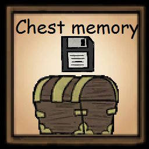

# mod-chest-memory

 
## Overview

Mod for the game [Don't Starve Together][] which is available through the
[Steam Workshop][]. The mod tracks the contents of a chest.

## Configuration

Don't like the default behaviour? Choose your own configuration to match your
needs:

| Configuration             | Default            | Description                                                                               |
| ------------------------- | ------------------ | ----------------------------------------------------------------------------------------- |
| **Highlight selected**    | _True_             | Increase the widget display size for the chest that is moused over.                       |
| **Default Show**          | _True_             | Should the chest display widget be shown by default?                                      |
| **Toggle Display**        | _J_                | Press this button to hide or show the chest widget.(Warning: Can be laggy)                |
| **Toggle Display Type**   | _Disable<=>Enable_ | Which options should the Toggle Display cycle through?                                    |
| **Highlight Active Item** | _False_            | Should chests, which contain the item you're holding, get highlight coloured?             |
| **Highlight ingredient**  | _False_            | Should chests, which contain the ingredient you're hovering over, get highlight coloured? |
| **Display Type**          | _All_              | How should the chest display be handled?                                                  |
| **Highlight Scale**       | _3_                | How much should the chests widget size get multiplied when highlighted?                   |
| **Special Hold**          | _LAlt_             | The button that has to be held to be able to scroll through chest memory.                 |
| **Widget Size**           | _8_                | Size of the displayed chest widget.                                                       |
| **Icebox Memory**         | _False_            | Should an Icebox memory be shown too?                                                     | 
| **Saltbox Memory**        | _False_            | Should a Saltbox memory be shown too?                                                     |

## License

Released under the [MIT License](https://opensource.org/licenses/MIT).

[don't starve together]: https://www.klei.com/games/dont-starve-together
[steam workshop]: https://steamcommunity.com/sharedfiles/filedetails/?id=2188383679

 
